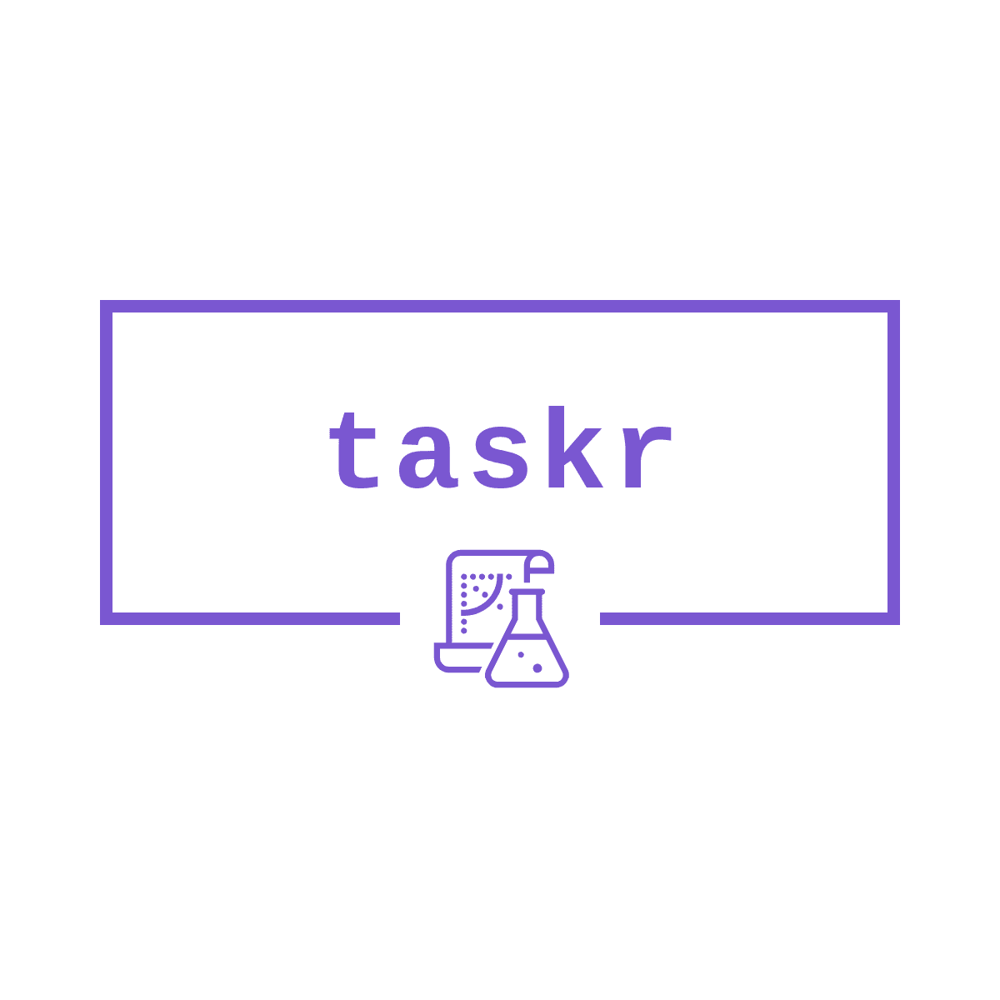

<p align="center"></p>

<h1 align="center">taskr</h1>

The simplest to install and use agile board (CLI and Web)

Just run
```bash
taskr init
```
To init the project in the current directory

And then
```bash
taskr backlog --task "Add more cool features 😃"
```


## Usage

The first step is to initialise a new project using tarkr. To do so, run in the current directory:

```bash
taskr init
```

This will create a ```taskr.json``` file in the current directory. All the future operations need to be run from the directory where this file resides. You can add this file to the versioning to enable tracking of the tasks and work across multiple environments.

In taskr tasks have four different sections:
1. Backlog
2. Selected for development
3. In progress
4. Done

When adding new tasks they are automatically added to the backlog. When the tasks are **moved** they follow the pipeline:
```
Backlog -> Selected for development -> In progress -> Done
```

To add a new task use

```bash
taskr backlog --task "My awesome task"
```

Optionally you may add ```--deadline``` option to track the finishing time for the task.

To list all the tasks run:

```bash
taskr tasks
```

This will output:
```bash
 BACKLOG               SELECTED FOR DEVELOPMENT  IN PROGRESS  DONE                     
 ---inspiring_buck---                                          ---blissful_ramanujan--- 
 My awesome task                                              Cool                     
                                                              ---trusting_bassi---     
                                                              Work on projects              
```

When you want your task to move across the pipeline take the id of the task (---blissful_ramanujan) and run:
```bash
taskr mv --task inspiring_buck
```

This will output:
```bash
 BACKLOG  SELECTED FOR DEVELOPMENT  IN PROGRESS  DONE                     
          ---inspiring_buck---                   ---blissful_ramanujan--- 
          My awesome task                        Cool                     
                                                 ---trusting_bassi---     
                                                 Work on projects         
```

### Installing

Download the newest release for your system from the **Releases** tab in GitHub.

## Running the tests

Explain how to run the automated tests for this system (Work on it)

## Built With

* [Go](https://golang.org) - The backend & cli language
* [Gin](https://gin-gonic.com/) - The web framework used
* [VueJs](https://vuejs.org) - The frontend framework
* [CLI](https://github.com/urfave/cli) - The cli framework
* [Packr](https://github.com/gobuffalo/packr) - The tool to embed static assets in go binary

## Contributing

Please read [CONTRIBUTING.md](https://gist.github.com/PurpleBooth/b24679402957c63ec426) for details on our code of conduct, and the process for submitting pull requests to us.

## Authors

* **Ilkin Musayev** - *Initial work* - [PurpleBooth](https://github.com/PurpleBooth)

See also the list of [contributors](https://github.com/paladium/taskr/Contributors.md) who participated in this project.

## License

This project is licensed under the MIT License - see the [LICENSE](LICENSE) file for details

## Acknowledgments

* https://notion.so - for their minimalism and clever use of Markdown
* https://marketplace.visualstudio.com/items?itemName=mkloubert.vscode-kanban - for the idea of kanban board in the project
